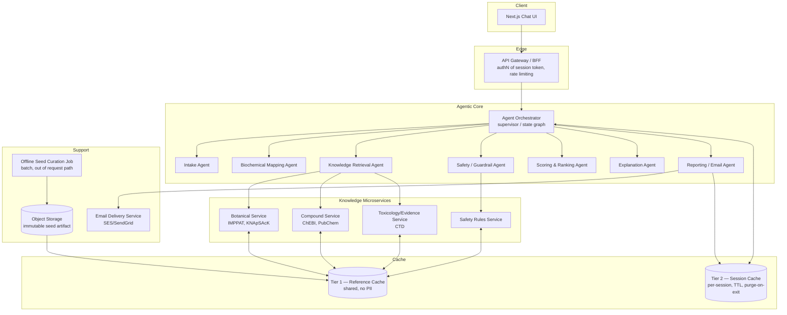
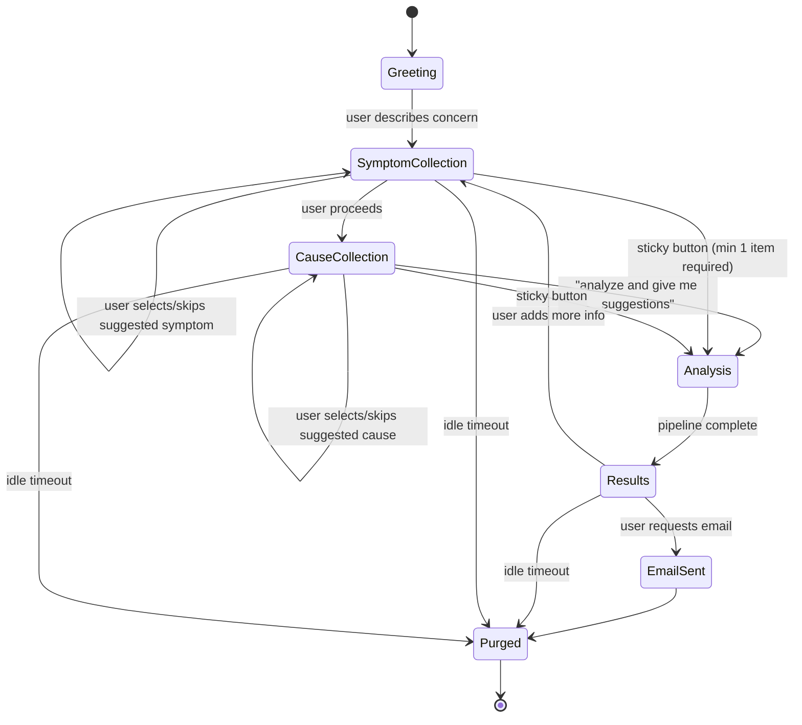

# Natural Treatment Recommendation Engine — Microservice, Agentic, Cache-Only Architecture (v2)

> **Status:** Supersedes the persistence model in `application_design.md`. Product vision, safety principles, scoring philosophy, and the conversational intake UX (section 12.5 of v1) are unchanged and still apply — this document replaces the *architecture, data storage, and deployment* sections with a microservice / agentic / cache-only design, and adds the email export capability.

---

## 1. What Changed From v1, and Why

v1 assumed a persistent PostgreSQL knowledge base and `user_profiles` / `recommendations` tables. The new requirements are:

1. **Full microservice architecture**, independently scalable per component.
2. **Agentic execution** — the pipeline (intake → mapping → retrieval → safety → scoring → explanation) is run by cooperating LLM-driven agents, not a single monolithic scoring function.
3. **Cache-only runtime, no persistent store.** No service is allowed to write to a durable database as part of normal operation. All working state — including the herb/compound/symptom knowledge graph itself — lives in cache (Redis) and is rebuilt from an immutable, offline-curated seed artifact and/or live external API calls.
4. **Email export before teardown.** At any point, the user can trigger "send me everything," which compiles the full chat transcript and findings into an email, sends it, and then purges the session.

The hardest consequence of #3 is that the *knowledge base* (herbs, compounds, evidence links — previously section 8 tables in v1) is no longer a queryable database either. That's addressed in §4.

---

## 2. Two Cache Tiers (the core design decision)

Everything lives in Redis. Nothing is written to disk-backed, durable storage as part of request handling. But not all cached data has the same lifecycle, so the design uses two tiers:

| Tier | Contents | Scope | Contains PII? | Lifecycle |
|---|---|---|---|---|
| **Tier 1 — Reference cache** | Herb/compound/symptom knowledge graph, evidence records, safety/contraindication rules | Shared across all sessions on the cluster | No | Rebuilt from the immutable seed bundle at deploy/cold-start; short TTL (e.g. 6–24h) with background refresh; **never contains a single user's data** |
| **Tier 2 — Session cache** | Chat transcript, symptom cache, cause cache, user profile, in-flight agent state, final recommendations | Namespaced per session (`session:{id}:*`) | Yes | TTL'd (idle timeout, e.g. 30 min) and **hard-deleted** on session end, email-sent, or explicit purge |

Both tiers run on Redis with **AOF/RDB persistence disabled** — if the Redis process restarts, Tier 1 rewarms itself from the seed bundle and Tier 2 simply disappears (which is the desired behavior for user data: a crash is a valid form of "destroyed"). This makes "everything is cache, and cache is destroyed" literally true at the infrastructure level, not just a policy promise.

### 2.1 The seed bundle (not a database)

Practical reality: hitting IMPPAT, ChEBI, PubChem, and CTD live, for every herb/compound, on every single user session, is too slow and too fragile (rate limits, multi-second/minute latencies, external outages) to build a usable product on.

The resolution: an **offline, versioned, read-only curation job** (a batch pipeline, not a live service) periodically queries the external APIs, normalizes results, and produces a signed artifact (e.g. `kb-2026.07.20.tar.zst` containing JSON/Parquet records) stored in object storage. This artifact is:
- built outside the request path, on a schedule (e.g. weekly) or on manual trigger,
- versioned and immutable once published,
- the *only* thing any live service loads into Tier 1 cache at startup.

No live service ever writes to this artifact. It is conceptually closer to a "container image layer" or "static config" than a database — there is no mutable, durable store that the running application owns. If you want the strictest possible reading of "no persistent store at all," the seed bundle can instead be inlined at build time into the Knowledge microservices' container images, so there isn't even an external object-storage dependency at runtime — trade-off is a larger image and a rebuild-and-redeploy to refresh data instead of a hot artifact swap. Pick based on how often you expect to refresh curated data (weekly refresh → object storage + warm-up job; monthly-or-less → bake into the image).

### 2.2 Live fallback

On a Tier 1 cache miss (e.g., a user mentions an obscure herb not in the seed bundle), the relevant Knowledge microservice may call the live external API directly, store the normalized result into Tier 1 with a short TTL, and continue. This is a fallback path, not the primary path — it has its own circuit breaker and timeout so a slow/down external API degrades gracefully (fewer candidates surfaced) rather than blocking the user's session.

---

## 3. Service Map



### 3.1 Service responsibilities

| Service | Responsibility | Statefulness | Scales on |
|---|---|---|---|
| API Gateway / BFF | Session token issuance/validation, request routing, rate limiting, abuse protection | Stateless | Request rate (RPS) |
| Agent Orchestrator | Runs the multi-agent state graph for a session; sequences intake → mapping → retrieval → safety → scoring → explanation → report | Stateless (state lives in Tier 2) | Concurrent sessions |
| Intake Agent | Drives the conversational flow; generates related-symptom/cause suggestions | Stateless | Invocation volume |
| Biochemical Mapping Agent | Symptom set → candidate biochemical imbalance patterns | Stateless | Invocation volume |
| Knowledge Retrieval Agent | Expands imbalances → compounds → herbs by calling Knowledge microservices | Stateless | Invocation volume |
| Safety / Guardrail Agent | Independently checks every candidate against contraindications/interactions **before** it can be shown | Stateless | Invocation volume |
| Scoring & Ranking Agent | Computes confidence score per candidate (unchanged formula, see §7) | Stateless | Invocation volume |
| Explanation Agent | Produces natural-language rationale per recommendation | Stateless | Invocation volume |
| Reporting / Email Agent | Compiles transcript + findings, hands off to Email Delivery Service, triggers purge | Stateless | Session end events |
| Botanical / Compound / Toxicology Services | Wrap external APIs, normalize, read/write Tier 1 cache | Stateless | External API call volume |
| Safety Rules Service | Serves contraindication/interaction rules from Tier 1 | Stateless | Read volume |
| Email Delivery Service | Sends the final email via a transactional provider | Stateless | Outbound email volume |
| Offline Seed Curation Job | Batch job producing the seed artifact | N/A (out of request path) | Not user-facing |

Every user-facing service is stateless by design — the only stateful component in the whole system is Redis itself, which is exactly why the cache-only requirement is achievable without turning services into fragile singletons.

### 3.2 Why the Safety Agent is separate from the Scoring Agent

This is a deliberate safety-architecture choice, not just service decomposition: **the agent that decides "is this safe to show" must not be the same agent (or same prompt/reasoning pass) that decides "how good is this recommendation."** An agent optimizing for a compelling, well-scored recommendation has a structural incentive to rationalize borderline safety calls. Keeping Safety as an independent adversarial check — with the rules service as ground truth, not an LLM's judgment alone — means a recommendation can score well and still be hard-blocked. This mirrors v1 §7.6/§13 but makes the independence explicit and structural rather than a hopeful convention.

---

## 4. Agent Orchestration Pattern

The Orchestrator implements a **supervisor / state-graph pattern**: a single stateful graph per session (state persisted in Tier 2, not in the orchestrator process itself, so any orchestrator replica can pick up any session). Nodes are agent calls; edges are determined by conversation state.



The `Analysis` state fans out to Mapping → Retrieval (parallel calls to Botanical/Compound/Toxicology services) → Safety → Scoring → Explanation, each step's output appended to the session state in Tier 2. Fan-out calls within Analysis run concurrently (async I/O), each with its own timeout and circuit breaker so one slow external dependency doesn't stall the whole session.

Each agent is a stateless tool-calling LLM step with a narrow, explicit tool surface — e.g. the Knowledge Retrieval Agent only has tools `search_botanical`, `search_compound`, `search_toxicology`, and cannot call the Safety Rules service or write final recommendations directly. Narrow tool grants per agent limit the blast radius of a prompt-injection or reasoning error in any single agent.

---

## 5. Session & Cache Key Design

```
# Tier 2 — session-scoped, PII, TTL'd
session:{sid}:meta                 hash    { current_step, created_at, last_active_at, locale }
session:{sid}:profile              hash    { age_range, pregnancy_status, medications[], allergies[], conditions[] }
session:{sid}:chat                 stream  ordered chat messages (role, text, ts)
session:{sid}:symptoms             hash    { symptom_id -> {label, source, confidence, ts} }
session:{sid}:causes                hash    { cause_id -> {label, category, confidence, ts} }
session:{sid}:candidates            list    intermediate candidate herbs/compounds during Analysis
session:{sid}:recommendations       list    final ranked, scored, explained results
session:{sid}:safety_log            list    per-candidate accept/reject + rule fired (session-scoped only, purged with the rest)

# Tier 1 — shared reference, no PII, background-refreshed
ref:herb:{slug}                     hash    herb record incl. compound profile refs
ref:compound:{id}                   hash    compound record (ChEBI/PubChem normalized)
ref:symptom:{slug}                  hash    symptom → candidate imbalance mappings
ref:evidence:{id}                   hash    evidence source record
ref:rule:{id}                       hash    contraindication/interaction rule
ref:kb_version                      string  currently loaded seed bundle version
```

TTL policy:

| Key pattern | TTL | Refresh trigger |
|---|---|---|
| `session:{sid}:*` | 30 min sliding (reset on activity) | Any user action |
| `ref:*` | 6–24h | Background warm-up job re-reads latest seed bundle; live-fallback writes use a short TTL (e.g. 1h) since they weren't curated |

On session end (explicit end, email sent, or idle expiry firing), the Orchestrator issues a single `DEL session:{sid}:*` (via `SCAN`+`UNLINK` for non-blocking eviction) and emits a purge-confirmation event — no soft-delete, no "trash" period.

---

## 6. Email Export

### 6.1 Flow

1. User clicks the sticky "I have said everything I know now — analyze and give me suggestions" button → Analysis runs → Results shown (per v1 §12.5).
2. A second action, "email me this conversation and findings," prompts for an email address inline in the chat.
3. Gateway issues a short-lived (e.g. 10 min) **verification token** and sends a one-time confirmation link/code to that address via the Email Delivery Service — this is a deliberate anti-abuse step (see 6.3), not optional.
4. On confirmation, the Reporting/Email Agent compiles the transcript + symptom/cause caches + ranked recommendations + safety notes + disclaimer into an HTML + plain-text email and sends it.
5. On successful send, the Orchestrator immediately purges the session (Tier 2 keys deleted), and the UI shows "Sent — this session's data has been deleted."

### 6.2 Email content

- Full chat transcript (chronological)
- Symptom cache and cause cache as collected
- Top recommendations with score, confidence band, explanation, evidence level, and safety note (same shape as v1 §18 example)
- The standard disclaimer: informational only, not a substitute for medical care
- No tracking pixels, no marketing content — this is a one-time transactional send tied to the session, not the start of an email relationship

### 6.3 Anti-abuse (important — a public "send arbitrary email" feature is a spam/relay vector)

- **Mandatory address verification** before any content is sent (step 3 above) — prevents using the feature to send unsolicited content to third-party addresses.
- Rate limit per session (one send) and per source IP (e.g. N verification attempts per hour).
- Transactional-email provider (SES/SendGrid/Postmark) with proper SPF/DKIM/DMARC on the sending domain, and provider-side reputation/suppression-list handling.
- No user-supplied HTML/content is embedded raw — the Reporting Agent renders content into a fixed template, so the send path can't be used as an open HTML-injection or phishing vector.
- Email delivery failures/bounces are logged only as anonymized delivery-status metrics (send succeeded/failed count), never re-associated with the session content, since the session is purged immediately after send regardless of downstream bounce status.

---

## 7. Scoring Model (unchanged from v1, restated for completeness)

```
Score = 0.30 × Evidence Strength
      + 0.25 × Mechanism Relevance
      + 0.20 × Concentration / Bioavailability
      + 0.15 × Safety Profile
      + 0.10 × Traditional / Historical Use

Adjusted Score = Base Score × Safety Factor
  Safety Factor: 1.0 low-risk | 0.6 moderate | 0.2 high | 0 disallowed
```

All inputs to this formula are read from Tier 1 (`ref:herb:*`, `ref:compound:*`, `ref:evidence:*`, `ref:rule:*`) at scoring time — there is no separate scoring database; the Scoring Agent computes and writes results directly into `session:{sid}:recommendations`.

---

## 8. Scalability & Deployment

- **Compute:** every service is a stateless container on Kubernetes (or equivalent), scaled via Horizontal Pod Autoscaler on CPU/RPS/queue-depth. Because no service holds local state, scaling out is just adding replicas — no sharding logic needed at the app layer.
- **Cache:** managed Redis Cluster (e.g. ElastiCache/MemoryDB/Upstash) sharded by session ID hash for Tier 2; Tier 1 can live on a small dedicated Redis deployment (read-heavy, low write volume, easy to replicate for read scaling) or as replicated read-through cache nodes co-located near the Knowledge services.
- **Fan-out concurrency:** the Orchestrator issues Botanical/Compound/Toxicology calls concurrently during Analysis; each Knowledge microservice scales independently based on its own external-API-bound latency profile (these differ a lot — ChEBI/PubChem are typically fast, CTD batch lookups can be slower).
- **Async messaging (optional, phase 2):** if agent fan-out volume grows, replace direct service-to-service calls with a lightweight queue (Redis Streams for MVP; Kafka/SQS if cross-region or very high throughput is needed later) between Orchestrator and Knowledge services, so retrieval work can be parallelized and retried without blocking the request thread.
- **API Gateway:** rate limiting and session-token validation happen here so abusive traffic is rejected before it reaches the agentic core (which is the most expensive part of the system, since it makes LLM calls).
- **Observability:** structured logs and traces (OpenTelemetry) must be scrubbed of symptom/profile content before export to any log aggregator — log retention should be short (24–48h) and metrics should be aggregate-only (e.g. "sessions completed," "safety rule X fired N times") to stay consistent with the ephemeral-data promise. This is the one place the design needs explicit policy discipline, since "temporary debug logs" are the most common way an ephemeral-data system quietly becomes a permanent one.

---

## 9. Open Trade-offs to Decide Before Building

1. **Seed bundle refresh cadence** — weekly object-storage swap vs. baked into container images (§2.1). Affects how "live" the knowledge stays vs. deploy simplicity.
2. **Live external-API fallback on cache miss** — enabling it improves coverage for obscure herbs but adds per-session latency variance and external dependency risk; disabling it means "not in the seed bundle" = "not recommendable" for that session.
3. **Governance/audit requirement vs. ephemeral promise** — v1 §13 asked for "log every recommendation decision and reason" for expert review. Under a strict no-persistence model this is only possible as fully anonymized, aggregate, non-reversible metrics (no symptom/user linkage) shipped async — flagging this explicitly since it's a real tension between safety governance and the privacy requirement, not a solved problem.
4. **Idle-timeout UX** — how much warning before auto-purge, and whether an unsent, abandoned session should proactively prompt "email this before it's deleted?"

---

## 10. What Stays the Same From v1

- Product vision, non-goals, and safety principles (v1 §1–4, §13)
- Conversational intake UX and state model (v1 §12.5) — `current_step`, `symptom_cache`, `cause_cache` map directly onto the Tier 2 Redis keys in §5
- Scoring formula and factor definitions (v1 §9, restated in §7 here)
- MVP data scope targets (50–100 herbs, 200–500 compound mappings, 20–30 symptom categories) — now the target size of the seed bundle rather than DB row counts
- Example recommendation response shape (v1 §18)
